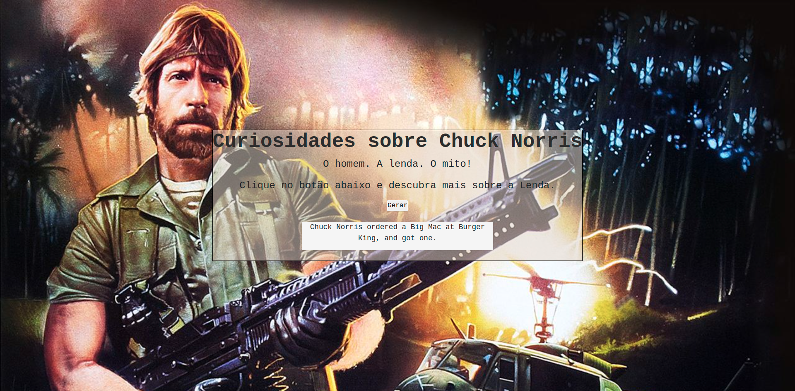

# Facts About Chuck Norris

Pequeno projeto dedicado a prática de consumo de API's.

## 🔧 Funçoes (opcional)

### Função 01:
- Consome dados da API de fatos sobre Chuck Norris

### Função 02:
- Renderiza na página o retorno da API 

## Feito Com:

## 🤝 Contribuição

Projeto aberto para ajuda!

### Support Ou Contato

Copyright © 2021 Pedro Fonseca

